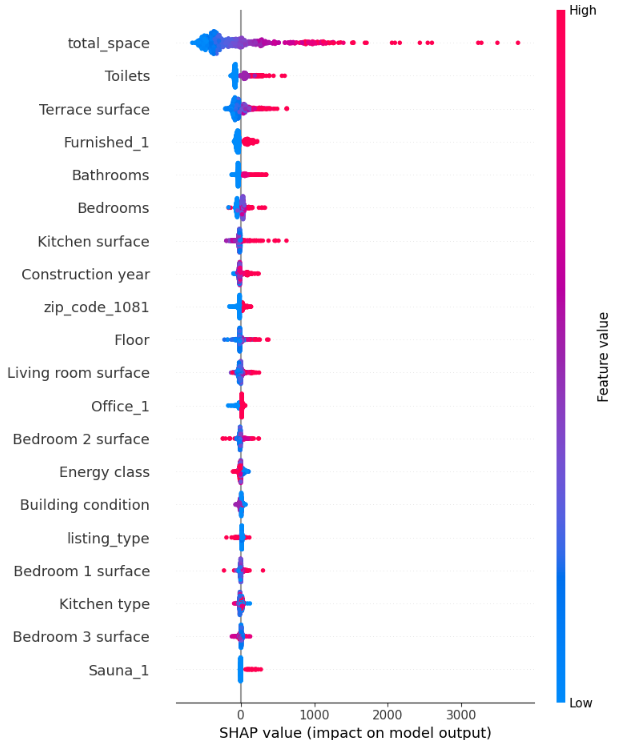
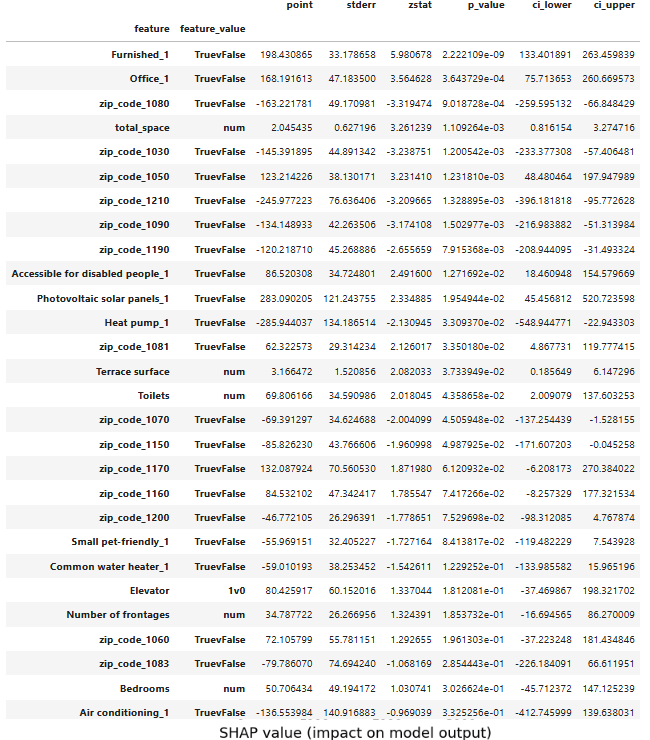
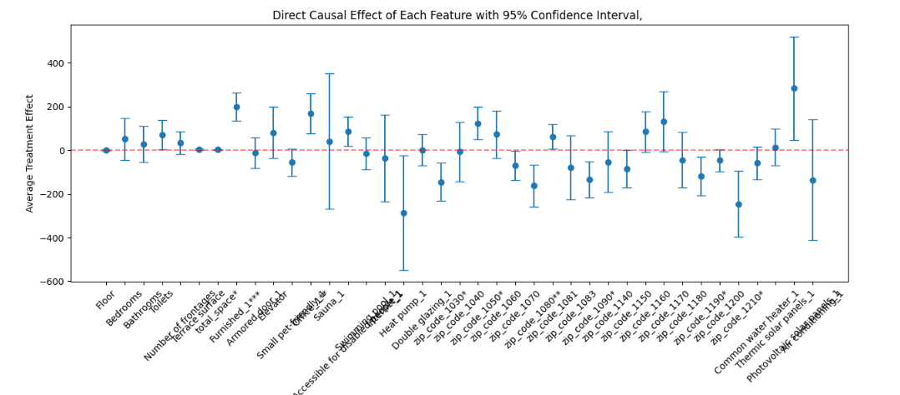
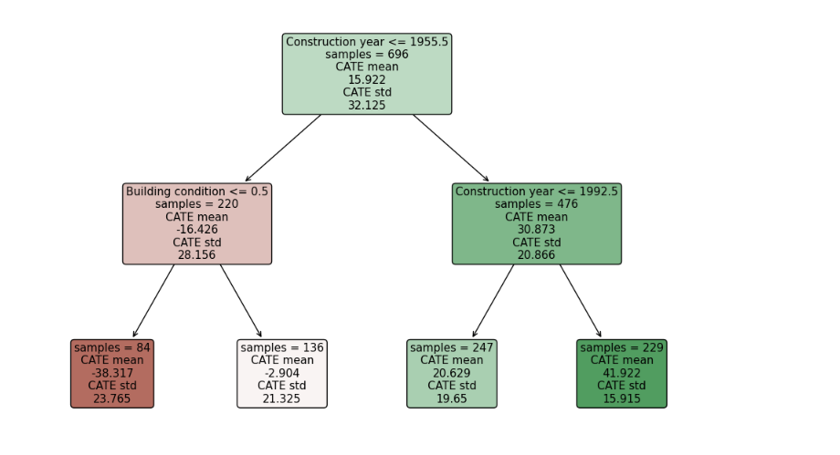

# Causal Analysis of Rental Price Determinants: Policy Insights for Real Estate Interventions in Brussels

## Table of Contents

1. Introduction
2. Dataset Features
3. Exploratory Data Analysis
4. Model Interpretation and Causal Analysis
   - SHAP Analysis
   - Statistical Significance
   - Direct Causal Effects
   - Heterogeneous Treatment Effects
5. Conclusions and Policy Implications

## Built With

- 
- 
- 
- 
- 

Introduction

In today's dynamic real estate market, understanding the factors that influence rental prices is critical for property owners, investors, and policymakers. Traditional models often provide predictions based on correlations, but they may not fully capture the causal relationships between different property features and rental prices. This project takes a step further by employing causal inference techniques to determine not only which features are most important in predicting rental prices but also how interventions like adding amenities or making structural improvements can impact rental returns.

The project begins with  exploratory data analysis (EDA), as the dataset used is notably dirty, with a significant portion of missing values. Careful imputation techniques were employed to handle these gaps and prepare the data for analysis. After cleaning the data, a monthly rental price prediction model was built to extract the most important predictive features using SHAP values, which helped highlight the top-ranking variables that contribute to rental price predictions.

However, while SHAP values reveal feature importance in a predictive sense, they do not provide insights into the causal effects of these features. To bridge this gap, we leverage CausalAnalysis from EconML to determine which features not only correlate with higher rents but also causally impact rental prices. By understanding the actual causal relationships, we can provide more reliable insights into how specific property features influence rental income.

In the next phase, we explore how property features—such as heating systems, solar panels, furnishing, and building conditions—affect rental prices through causal inference models. Using tools like policy trees and heterogeneity analysis, we dive deep into how these features impact different types of properties.

Ultimately, this project aims to offer actionable insights for real estate decision-makers, highlighting which property features have the greatest potential to increase rental prices and guiding cost-effective property improvements.

## Dataset Features

| Feature Name | Description |
|-------------|-------------|
| Monthly rental price | Monthly cost charged for renting the property in Brussels |
| Living area | Total habitable area of the property in square meters |
| Bedrooms | Number of rooms designated as bedrooms in the property |
| Energy class | Energy performance rating of the property (e.g., A, B, C, D, E, F, G) |
| Building condition | Overall state of the property (e.g., excellent, good, to renovate) |
| Location | Area/neighborhood within Brussels where property is located |
| Construction year | Year when the building was originally constructed |
| Heating type | Primary heating system used (e.g., central, electric, gas) |
| Double glazing | Whether windows have double-pane insulation for energy efficiency |
| Furnished | Whether the property is rented with furniture included |

## Model Interpretation: Feature Importance Analysis

Our model's predictions were analyzed using SHAP (SHapley Additive exPlanations) values to understand the impact of each feature on rental price predictions. The analysis reveals:

### Key Insights:
- **Total Space** has the strongest impact on rental prices, showing significant influence on model predictions
- **Toilets**, **Terrace surface**, and **Furnished** status are the next most influential features
- **Building Characteristics** (Bathrooms, Bedrooms, Kitchen surface) show moderate impact
- **Construction year** and **Floor** level demonstrate notable influence
- Specific location indicators (e.g., **zip_code_1081**) have measurable effects on price predictions
- Basic amenities and features like **Kitchen type** and **Bedroom surface areas** show relatively lower but consistent impact

The color gradient in the plot indicates feature values (blue = low, red = high), while the horizontal position shows the magnitude of impact on the model's rental price predictions.

## Model Interpretation and Causal Analysis

### 1. Statistical Significance of Features (p-values)

The table above shows the statistical significance (p-value) of each feature's causal effect. Key observations:
- Features like 'Furnished_1' and 'Office_1' show very high statistical significance (p-value < 1e-09)
- Location features (zip codes) demonstrate varying levels of significance
- Some amenities like 'Common water heater_1' show lower statistical significance

### 2. Direct Causal Effects

The causal analysis shows the Average Treatment Effect (ATE) with 95% confidence intervals for each feature:
- Some features show strong positive causal effects but with wide confidence intervals
- Location-based features (zip codes) demonstrate varying causal impacts
- The width of confidence intervals indicates the uncertainty in our causal estimates

### Key Insights:
1. **Predictive vs Causal Relationships**
  - Features highly ranked in SHAP analysis may not have strong causal relationships
  - This distinction helps identify which features truly influence prices versus those that are merely correlated

2. **Location Effects**
  - Different zip codes show varying levels of both predictive and causal importance
  - This suggests that location plays a complex role in rental price determination

3. **Policy Implications**
  - Features with both strong predictive power and significant causal effects should be prioritized
  - Wide confidence intervals suggest areas where more data might be needed
  - These insights can guide evidence-based policy interventions in the Brussels real estate market

*Note: All analyses include 95% confidence intervals and p-values for statistical validation.*

## Heterogeneous Treatment Effects Analysis

### Conditional Average Treatment Effects (CATE)

We used the presence of a thermic solar panel as an example to analyze how different types of apartments may experience varying increases in monthly rental prices when adding this amenity. The decision tree analysis reveals significant heterogeneity in treatment effects:

### Key Findings:

1. **Age-Based Effects**
  - Properties built before 1955: Show moderate positive effects (CATE mean = 15.922)
  - Properties built between 1955-1992: Demonstrate stronger positive effects (CATE mean = 30.873)
  - Properties built after 1992: Display the strongest positive effects (CATE mean = 41.922)

2. **Building Condition Impact**
  - For older properties (pre-1955):
    - Poor condition (≤ 0.5): Show negative effects (CATE mean = -16.426)
    - Better condition: Demonstrate more positive effects
  - Standard deviation varies significantly across segments, indicating varying levels of uncertainty

3. **Strongest Treatment Effects**
  - Newer properties (post-1992) show the highest positive impact (CATE = 41.922)
  - Properties in better condition consistently show more favorable treatment effects
  - Lower standard deviations in newer properties suggest more reliable estimates

This analysis suggests that the causal impact of solar panels varies significantly based on the property's age and condition, with newer properties generally showing stronger positive effects on rental prices. This insight is valuable for targeted property improvements and policy recommendations.

*Note: CATE (Conditional Average Treatment Effect) is a crucial concept in causal inference, allowing for more personalized interventions by accounting for heterogeneity across different subpopulations.*
